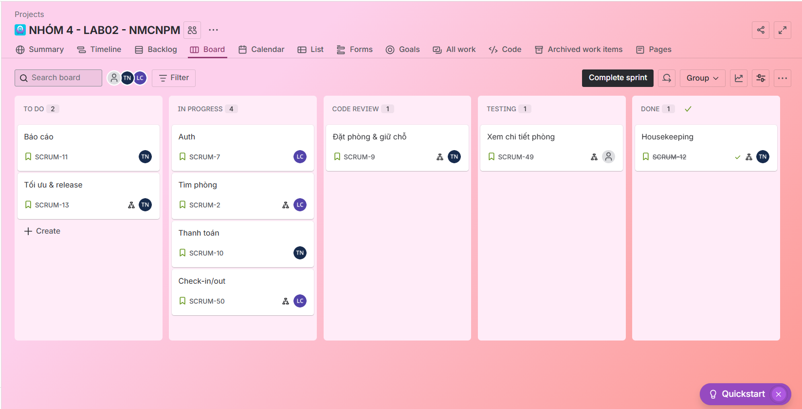

# LAB02-NMCNPM-JIRA
Lab 02 – Phân tích yêu cầu &amp; Thiết kế Use Case (Hotel Booking System)
# 🏨 Hotel Booking System – Lab 02 Report

## 👥 Nhóm thực hiện

- Lương Kim Chi – MSSV: N23DCPT066 – Phân tích yêu cầu, thiết kế ERD, 
- Hoàng Lê Nguyên Khang – MSSV: N23DCPT025 – Thiết kế Sequence Diagram, quản lý Jira
- Trương Quỳnh Như – MSSV: N23DCPT099 – Thiết kế Usecase, quản lý Jira, tổng hợp báo cáo

---

## 📌 Mục tiêu

Phân tích yêu cầu và thiết kế hệ thống đặt phòng khách sạn bằng UML, xây dựng sơ đồ Use Case, Sequence Diagram, ERD, và triển khai quy trình Agile Scrum trên Jira. Đồng bộ hóa với GitHub để quản lý mã nguồn và tài liệu.

---

## 🧠 1. Phân tích yêu cầu

### 🎯 Đối tượng sử dụng hệ thống

- Guest (Khách hàng)
- Receptionist (Lễ tân)
- Manager (Quản lý)
- Payment Gateway (Cổng thanh toán)
- Housekeeping (Buồng phòng)

### 🧾 Các chức năng chính

- Tìm kiếm & xem chi tiết phòng  
- Đặt phòng online  
- Thanh toán online  
- Check-in / Check-out  
- Quản lý phòng & giá  
- Quản lý đặt phòng  
- Quản lý công việc buồng phòng  
- Báo cáo doanh thu  

---

## 📐 2. Thiết kế Use Case Diagram

Sơ đồ Use Case mô tả các chức năng chính của hệ thống và mối quan hệ giữa các tác nhân. 

---

## 🔁 3. Sequence Diagram

### a. Luồng Đặt phòng online

1. Guest chọn phòng → hệ thống giữ phòng  
2. Guest nhập thông tin → thực hiện thanh toán  
3. Cổng thanh toán trả kết quả → xác nhận & gửi email  

### b. Luồng Check-in / Check-out

1. Receptionist tra cứu mã đặt phòng  
2. Check-in: gán phòng, cập nhật trạng thái  
3. Check-out: tổng hợp chi phí, thu tiền, cập nhật buồng phòng  

---

## 🗃️ 4. Thiết kế cơ sở dữ liệu (ERD)

### Các bảng dữ liệu chính:

- Guest(GuestID, Name, Phone, Email, Address)  
- RoomType(TypeID, Name, Price, Capacity, Description)  
- Room(RoomID, TypeID, Status, Floor)  
- Reservation(ResvID, GuestID, RoomID, StaffID, CheckInDate, CheckOutDate, Status)  
- Payment(PaymentID, ResvID, Amount, Method, Status, Date)  
- Staff(StaffID, Name, Role, Username, PasswordHash)  

---

## 🚀 5. Agile Scrum trên Jira

### 🧾 Product Backlog

- Đăng ký/Đăng nhập khách hàng  
- Tìm phòng & xem chi tiết  
- Đặt phòng & thanh toán  
- Check-in / Check-out  
- Quản lý phòng & giá  
- Báo cáo doanh thu  
- Công việc buồng phòng  

### 🗓️ Sprint Plan

- Sprint 1: Auth, tìm phòng  
- Sprint 2: Đặt phòng & giữ chỗ  
- Sprint 3: Thanh toán & check-in/out  
- Sprint 4: Báo cáo, housekeeping, tối ưu & release  

### 📋 Jira Board

- To Do → In Progress → Code Review → Testing → Done  
- Mỗi user story mô tả theo format:  
  `As a [role], I want [function], so that [benefit]`

📎 Jira Board Screenshot: 

---

## 🔗 6. Đồng bộ GitHub

- Repo cá nhân: https://github.com/qynnku/LAB02-NMCNPM-JIRA
- Upload các artefact: Use Case, Sequence, ERD, README.md  
- Smart Commit: `#JIRA-123 Add: Booking use case diagram`

---

## ✅ Kết luận

Hệ thống Hotel Booking được thiết kế theo hướng hiện đại, đáp ứng đầy đủ các chức năng từ đặt phòng đến quản lý vận hành. Việc áp dụng UML và Agile Scrum giúp nhóm phát triển có quy trình rõ ràng, dễ mở rộng và bảo trì.

